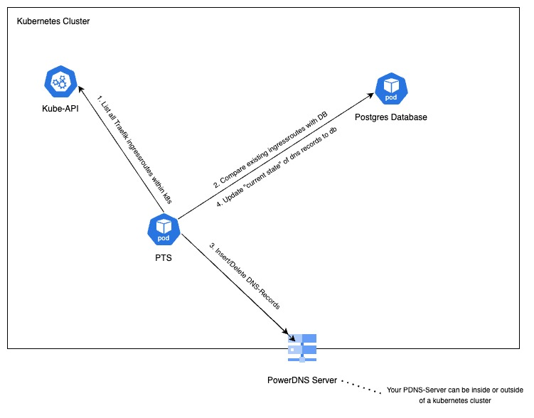

<a name="readme-top"></a>

[![Contributors][contributors-shield]][contributors-url]
[![Forks][forks-shield]][forks-url]
[![Stargazers][stars-shield]][stars-url]
[![Issues][issues-shield]][issues-url]
[![LinkedIn][linkedin-shield]][linkedin-url]


<!-- PROJECT LOGO -->
<br />
<div align="center">
  <a href="https://github.com/Tim-herbie/k8s_powerdns_traefik_sync">
    
  </a>

  <h3 align="center">PowerDNS Traefik Sync Tool for Kubernetes</h3>

  <p align="center">
    A Python-based Kubernetes application that monitors Traefik IngressRoutes within Kubernetes to automatically create DNS records in your PowerDNS-Server.
    <br />
    <br />
    ·
    <a href="https://github.com/Tim-herbie/k8s_powerdns_traefik_sync/issues/new?labels=bug&template=bug-report---.md">Report Bug</a>
    ·
    <a href="https://github.com/Tim-herbie/k8s_powerdns_traefik_sync/issues/new?labels=enhancement&template=feature-request---.md">Request Feature</a>
  </p>
</div>


<!-- TABLE OF CONTENTS -->
<details>
  <summary>Table of Contents</summary>
  <ol>
    <li>
      <a href="#about-the-project">About The Project</a>
    </li>
    <li>
      <a href="#getting-started">Getting Started</a>
      <ul>
        <li><a href="#prerequisites">Prerequisites</a></li>
        <li><a href="#installation">Installation</a></li>
      </ul>
    </li>
    <li><a href="#usage">Usage</a></li>
    <li><a href="#contributing">Contributing</a></li>
    <li><a href="#contact">Contact</a></li>
    <li><a href="#projects">Projects</a></li>
  </ol>
</details>


<!-- ABOUT THE PROJECT -->
## About The Project
<p align="center">
  <a href="https://github.com/Tim-herbie/k8s_powerdns_traefik_sync/blob/main/images/powerdns_traefik_sync.jpg">
    
  </a>
</p>


Traefik PowerDNS Updater is a Python-based Kubernetes application designed to streamline DNS management. It monitors Traefik IngressRoutes within your Kubernetes cluster and automatically creates or updates DNS records in PowerDNS.

Components:
* **PTS Tool (PowerDNS Traefik Sync)** Checks if Traefik ingressroutes were added or deleted and updates the PowerDNS via API
* **HA Postgres Database:** Database of DNS records for the current state (by [Postgres Zalando Operator](https://www.powerdns.com/))


<p align="right">(<a href="#readme-top">back to top</a>)</p>


<!-- GETTING STARTED -->
## Getting Started

The following requirements are necessary to install the project.

### System requirements for installation
- A running Kubernetes cluster
- kubectl installed and configured
- git installed and configured
- jq installed
- makefile installed

### Already installed within your Kubernetes Cluster
- Ingresscontroller Traefik
- Zalando Postgres Operator


## Usage

_The deployment is handled by a Makefile._ Please always use a [released tag version](https://github.com/Tim-herbie/k8s_powerdns_traefik_sync/releases) instead of the unstable main branch!

### Clone the repo
   ```sh
   git clone https://github.com/Tim-herbie/k8s_powerdns_traefik_sync.git
   ```

### Fill out variables 
  Before you can deploy it, you have at least to adjust the following Makefile variables:
  - PDNS_API_URL
  - DNS_ZONE
  - K8S_INGRESS
  
### Install the Makefile
   ```sh
   make all
   ```

<p align="right">(<a href="#readme-top">back to top</a>)</p>


<!-- USAGE EXAMPLES -->
## Documentation

### PDNS Paramters
| Parameter | Default value               | Description                 |
|--------|------------------------|---------------------------------------|
| PDNS_API_URL    | `https://pdns-auth.example.com/api/v1`           | The URL of your PowerDNS Server.             | 
| PDNS_API_KEY   | `secret`           | The Secret of your PowerDNS API. Fill it in the secret.yaml file               | 
| PDNS_ZONE_NAME    | `example.com.`       | The DNS Zoneof your PowerDNS Server, which you would like to create/update the dns records.          | 
| TTL    | `3600`       | The TTL of your dns records, which will be created.            |
| CONTENT | `ingress.example.com.`       | The DNS-Name of an existing dns record that point to your Kuberentes Ingress Gateway.                  |

### PTS Tool Paramters
| Parameter | Default value                | Description              |
|--------|------------------------|---------------------------------------|
| DEBUG_LOGGING    | `false`           | Debug Logging should only be activated for Troubleshooting, because it generates much Logs.             | 
| SLEEP_DURATION   | `45`           | The time interval for the loop to check if new Traefik Ingressroutes were created/deleted.                    | 
| TRAEFIK_CRD_GROUP   | `traefik.io`           | The CRD Group of Traefik.                    | 
| TRAEFIK_CRD_VERSION   | `v1alpha1`           | The CRD Version of Traefik                    | 
| TRAEFIK_CRD_PLURAL   | `ingressroutes`           | The CRD PLURAL of Traefik                   | 

### PSS Database Paramters
| Parameter | Default value                | Description                |
|--------|------------------------|---------------------------------------|
| PTS_DB_NAME    | `records`           | The name of the PTS PSQL Database.             | 
| PTS_DB_USER   | `postgres`           | The username of the PTS PSQL Database.                    | 
| PTS_DB_PASSWORD    | ``       | The password of the PTS PSQL Dtabase user.          | 
| PTS_DB_HOST    | `pts-postgres-db`       | The DNS name of the PTS PSQL Database.            |
| PTS_DB_PORT | `5432`       | The port of the PTS PSQL Database.                  |

### Debug Logs
If the `DEBUG_LOGGING` parameter in the `deployment.yaml` file is `false`, it will only log if a new Traefik Ingressroute was found or was not found anymore and deleted. If you are not sure that the tool is working fine, please change it to `true`.

<p align="right">(<a href="#readme-top">back to top</a>)</p>


<!-- CONTRIBUTING -->
## Contributing

Contributions are what make the open source community such an amazing place to learn, inspire, and create. Any contributions you make are **greatly appreciated**.

If you have a suggestion that would make this better, please fork the repo and create a pull request. You can also simply open an issue with the tag "enhancement".
Don't forget to give the project a star! Thanks again!

1. Fork the Project
2. Create your Feature Branch (`git checkout -b feature/AmazingFeature`)
3. Commit your Changes (`git commit -m 'Add some AmazingFeature'`)
4. Push to the Branch (`git push origin feature/AmazingFeature`)
5. Open a Pull Request

<p align="right">(<a href="#readme-top">back to top</a>)</p>


<!-- CONTACT -->
## Contact

Tim Herbert - info@timherbert.de

Project Link: [https://github.com/Tim-herbie/k8s_powerdns_traefik_sync](https://github.com/Tim-herbie/k8s_powerdns_traefik_sync)

<p align="right">(<a href="#readme-top">back to top</a>)</p>


<!-- PROJECTS -->
## Projects

Use this space to list resources you find helpful and would like to give credit to. I've included a few of my favorites to kick things off!

* [PowerDNS for Kubernetes](https://github.com/Tim-herbie/k8s_powerdns)
* [PowerDNS Traefik Sync Tool for Kubernetes](https://github.com/Tim-herbie/k8s_powerdns_traefik_sync)
* [FortiGate Exporter for Kubernetes](https://github.com/Tim-herbie/k8s_fortigate_exporter)
* [KeyCloak for Kubernetes](https://github.com/Tim-herbie/k8s_keycloak)

<p align="right">(<a href="#readme-top">back to top</a>)</p>


<!-- MARKDOWN LINKS & IMAGES -->
<!-- https://www.markdownguide.org/basic-syntax/#reference-style-links -->
[contributors-shield]: https://img.shields.io/github/contributors/Tim-herbie/k8s_powerdns_traefik_sync.svg?style=for-the-badge
[contributors-url]: https://github.com/Tim-herbie/k8s_powerdns_traefik_sync/graphs/contributors
[forks-shield]: https://img.shields.io/github/forks/Tim-herbie/k8s_powerdns_traefik_sync.svg?style=for-the-badge
[forks-url]: https://github.com/Tim-herbie/k8s_powerdns_traefik_sync/network/members
[stars-shield]: https://img.shields.io/github/stars/Tim-herbie/k8s_powerdns_traefik_sync.svg?style=for-the-badge
[stars-url]: https://github.com/Tim-herbie/k8s_powerdns_traefik_sync/stargazers
[issues-shield]: https://img.shields.io/github/issues/Tim-herbie/k8s_powerdns_traefik_sync.svg?style=for-the-badge
[issues-url]: https://github.com/Tim-herbie/k8s_powerdns_traefik_sync/issues
[license-shield]: https://img.shields.io/github/license/Tim-herbie/k8s_powerdns_traefik_sync.svg?style=for-the-badge
[license-url]: https://github.com/Tim-herbie/k8s_powerdns_traefik_sync/blob/master/LICENSE.txt
[linkedin-shield]: https://img.shields.io/badge/-LinkedIn-black.svg?style=for-the-badge&logo=linkedin&colorB=555
[linkedin-url]: https://www.linkedin.com/in/tim-herbert-cv/
[product-screenshot]: ../k8s_powerdns_traefik_sync/images/PowerDNS.jpg
[Next.js]: https://img.shields.io/badge/next.js-000000?style=for-the-badge&logo=nextdotjs&logoColor=white
[Next-url]: https://nextjs.org/
[React.js]: https://img.shields.io/badge/React-20232A?style=for-the-badge&logo=react&logoColor=61DAFB
[React-url]: https://reactjs.org/
[Vue.js]: https://img.shields.io/badge/Vue.js-35495E?style=for-the-badge&logo=vuedotjs&logoColor=4FC08D
[Vue-url]: https://vuejs.org/
[Angular.io]: https://img.shields.io/badge/Angular-DD0031?style=for-the-badge&logo=angular&logoColor=white
[Angular-url]: https://angular.io/
[Svelte.dev]: https://img.shields.io/badge/Svelte-4A4A55?style=for-the-badge&logo=svelte&logoColor=FF3E00
[Svelte-url]: https://svelte.dev/
[Laravel.com]: https://img.shields.io/badge/Laravel-FF2D20?style=for-the-badge&logo=laravel&logoColor=white
[Laravel-url]: https://laravel.com
[Bootstrap.com]: https://img.shields.io/badge/Bootstrap-563D7C?style=for-the-badge&logo=bootstrap&logoColor=white
[Bootstrap-url]: https://getbootstrap.com
[JQuery.com]: https://img.shields.io/badge/jQuery-0769AD?style=for-the-badge&logo=jquery&logoColor=white
[JQuery-url]: https://jquery.com 
